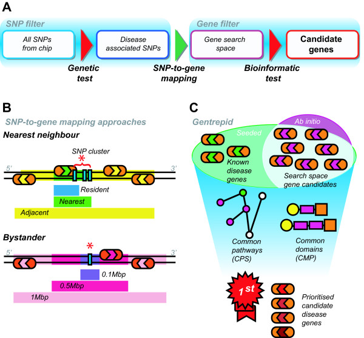
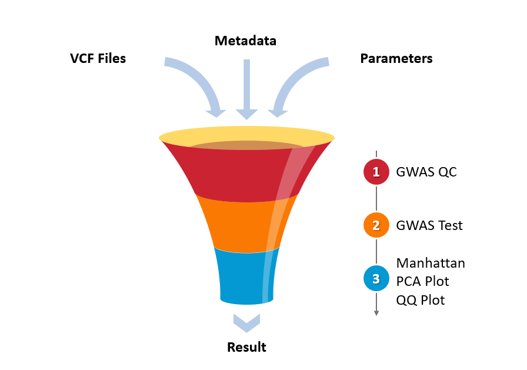

# GWAS

Summary of GWAS analysis methodology. (A) Double filter pipeline for GWAS data. The Genetic test filters for the disease-associated SNPs which are then mapped to genes. The Bioinformatics test, using Gentrepid, filters the genes for likely disease candidates. (B) SNP-to-gene approaches. The nearest neighbour approach consists of three sets: the resident set containing genes with SNPs internal to gene boundaries; the nearest set containing genes with SNPs internal or directly adjacent to the gene; and the adjacent set containing the four nearest genes to a SNP. The bystander approach consists of three sets where genes on both strands around SNPs were pooled from flanking intervals of fixed width. The sets include a 0.1 Mbp interval, 0.5 Mbp and 1 Mbp. Genes are represented as rounded rectangles and SNPs are marked as blue bars. (C) Gentrepid prediction method summary. A gene search space derived from GWAS data can be supplemented with known disease genes (seeded) or used stand-alone (ab initio). Genes involved in common pathways (CPS) or sharing common domains (CMP) within these search spaces are extracted by the system. Genes are prioritized based on the likelihood of genes with these properties occurring randomly.

[GWAS Pipeline](https://shivom.gitbook.io/documentation/pipelines/gwas-pipeline)

